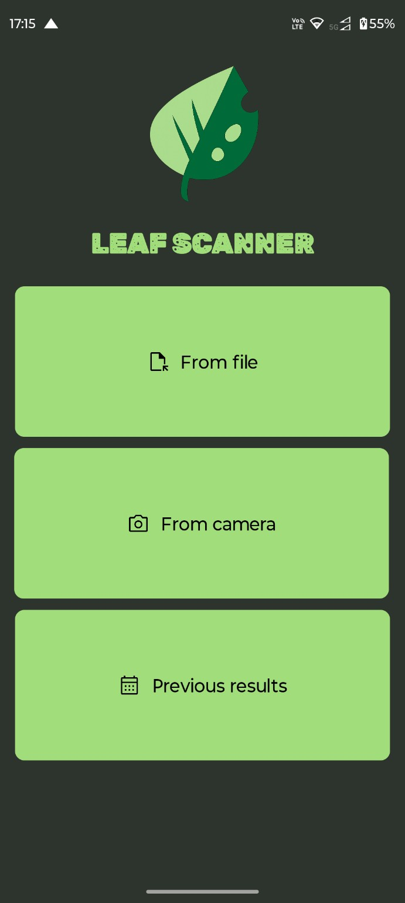
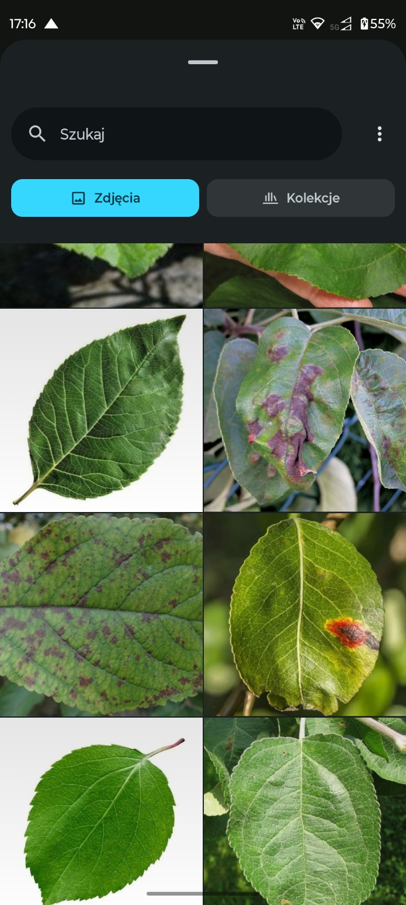
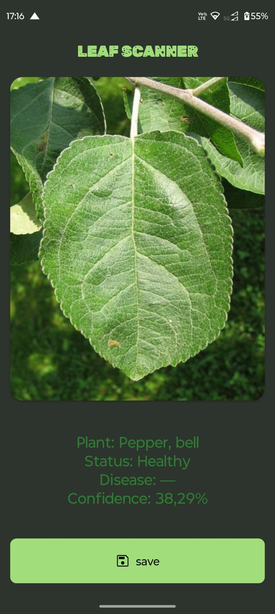
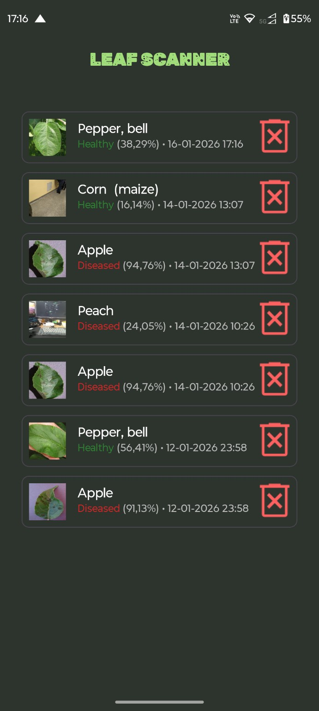
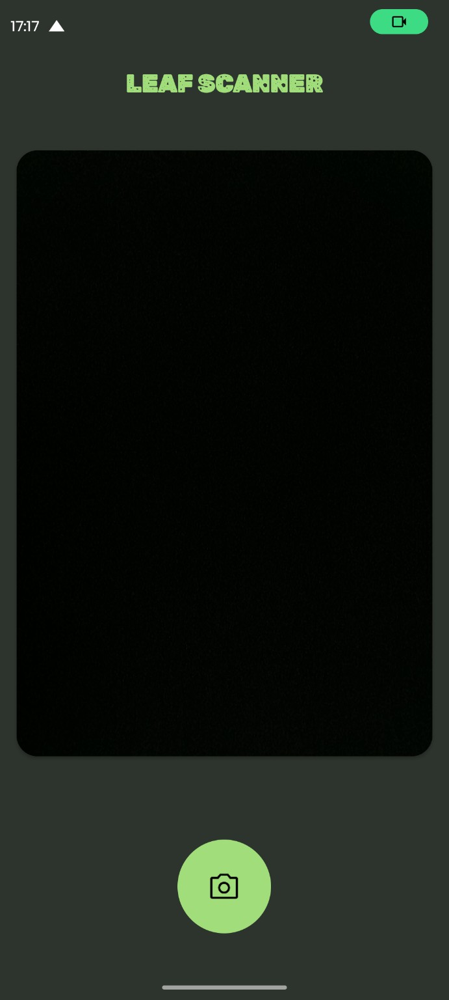

# 🌿 Leaf Scanner

**Leaf Scanner** is an Android application that uses machine learning to detect plant leaf diseases.  
The app allows users to take a photo or select an image from the gallery and instantly receive information about:

- plant species,
- health status (healthy / diseased),
- detected disease,
- model confidence.

The entire inference process runs **offline on the device** using a PyTorch model exported to `.ptl` and optimized for CPU.

---

## 📱 Features

- 📷 Scan leaves using **camera** or **gallery**
- 🧠 On-device **deep learning inference (PyTorch Mobile)**
- 🌱 Plant species recognition
- 🦠 Disease detection
- 📊 Confidence score for predictions
- 💾 Save scan results locally
- 🕒 Browse and manage **previous results**
- 🔒 Works fully **offline** (no internet required)

---

## 🖼️ Screenshots

<table>
  <tr>
    <th>Home</th>
    <th>Gallery</th>
    <th>Result</th>
    <th>History</th>
    <th>Camera</th>
  </tr>
  <tr>
    <td></td>
    <td></td>
    <td></td>
    <td></td>
    <td></td>
  </tr>
</table>

---

## 🧠 Machine Learning Model

- Framework: **PyTorch**
- Export format: **`.ptl` (TorchScript Lite)**
- Execution: **CPU**
- Inference: **On-device (offline)**

The model performs multi-class classification of plant leaves to determine both plant type and disease status.

---

## 🧪 Supported Classes

### 🍎 Apple

- Apple Scab
- Black Rot
- Cedar Apple Rust
- Healthy
 
### 🫐 Blueberry

- Healthy

### 🍒 Cherry (including sour)

- Powdery Mildew
- Healthy

### 🌽 Corn (Maize)

- Cercospora Leaf Spot / Gray Leaf Spot
- Common Rust
- Northern Leaf Blight
- Healthy

### 🍇 Grape

- Black Rot
- Esca (Black Measles)
- Leaf Blight (Isariopsis Leaf Spot)
- Healthy

### 🍊 Orange

- Huanglongbing (Citrus Greening)

### 🍑 Peach

- Bacterial Spot
- Healthy

### 🌶️ Pepper (Bell)

- Bacterial Spot
- Healthy

### 🥔 Potato

- Early Blight
- Late Blight
- Healthy

### 🍓 Strawberry

- Leaf Scorch
- Healthy

### 🍅 Tomato

- Bacterial Spot
- Early Blight
- Late Blight
- Leaf Mold
- Septoria Leaf Spot
- Spider Mites (Two-spotted Spider Mite)
- Target Spot
- Tomato Yellow Leaf Curl Virus
- Tomato Mosaic Virus
- Healthy

### 🌱 Other

- Raspberry – Healthy
- Soybean – Healthy
- Squash – Powdery Mildew

---

## 🛠️ Tech Stack

- **Android Studio**
- **Kotlin**
- **PyTorch Mobile / Lite Interpreter**
- **Jetpack Components**
- **Material Design**
- **Local storage (offline)**

---

## ⚙️ How to Run

1. Clone the repository:
   ```bash
   git clone https://github.com/USERNAME/LeafScanner.git
   ```
2. Open in **Android Studio**
3. Place the model file in:
   ```
   app/src/main/assets/leaf_model_mobile_cpu.ptl
   ```
4. Build and run on a physical Android device

---

## 📦 Build APK

**Debug APK**

```
Build > Build Bundle(s) / APK(s) > Build APK(s)
```

**Release APK**

```
Build > Generate Signed Bundle / APK
```

---

## 🔐 Privacy

- No data is sent to external servers
- All inference is performed locally on the device
- Images remain on the user’s phone

---

## 📌 Disclaimer

This application is intended for educational and informational purposes only.  
It is **not a substitute for professional agricultural or plant pathology advice**.

---

## 👤 Authors

Developed by **Dawid Rokita** and **Paweł Przewała**
